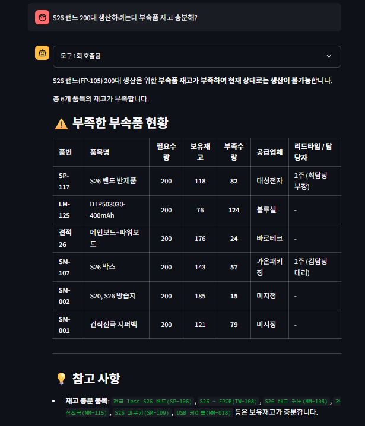
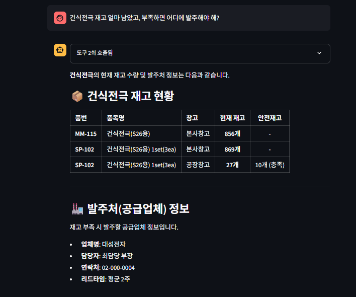
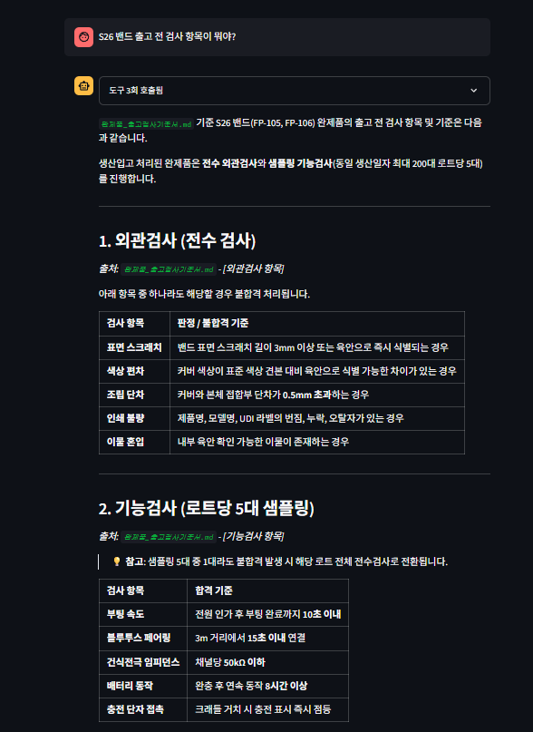
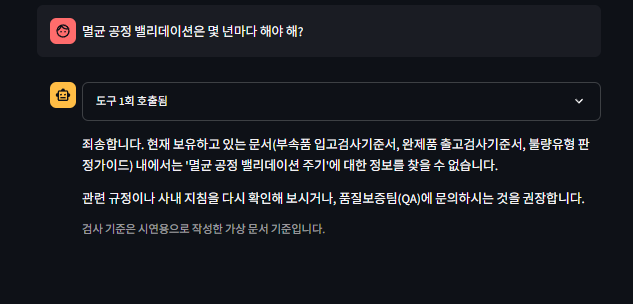

# QC·재고 AI 어시스턴트

사내 재고 데이터와 QC 문서를 함께 조회하는 챗봇입니다.
질문을 받으면 어떤 정보가 필요한지 스스로 판단해 도구를 호출하고,
여러 출처에서 얻은 결과를 합쳐 하나의 답을 만듭니다.

[사내 재고 현황 대시보드](https://github.com/youngho930/inventory-dashboard)에서
이어지는 프로젝트로, 같은 데이터 구조를 그대로 사용합니다.

## 왜 만들었나

대시보드를 만들어 재고 확인 시간을 건당 1-2분에서 30초로 줄였지만,
여전히 사람이 화면을 옮겨 다니며 판단해야 하는 일이 남아 있었습니다.

"S26 밴드 200대 생산하려는데 부속품이 충분한가"를 확인하려면
BOM 화면에서 소요량을 뽑고, 재고 화면에서 부속품을 하나씩 검색하고,
부족한 것이 나오면 협력업체 리드타임을 다시 찾아봐야 했습니다.
데이터는 다 있는데 그것들을 엮는 일이 사람 몫이었습니다.

여기에 검사 기준 확인처럼 문서를 뒤져야 하는 일까지 섞이면
찾아야 할 곳이 더 늘어납니다.

그래서 질문 하나로 이 과정을 끝내는 챗봇을 만들었습니다.

## 동작 방식

```
사용자 질문
    │
    ▼
  Gemini  ──── 어떤 도구가 필요한지 판단 (function calling)
    │
    ├─→ get_inventory                  재고 조회 + 안전재고 대조
    ├─→ get_bom                        BOM 전개 + 소요량 계산
    ├─→ check_production_feasibility   소요량 vs 재고 판정 + 리드타임
    ├─→ get_supplier                   협력업체 연락처·리드타임
    └─→ search_qc_docs                 QC 문서 검색 (임베딩 기반 RAG)
    │
    ▼
 결과를 종합해 답변 생성
```

한 질문에 여러 도구가 필요하면 순차적으로 호출합니다.
"건식전극 재고 얼마 남았고 부족하면 어디에 발주해야 해?" 같은 질문은
재고 조회와 협력업체 조회를 모두 거쳐 하나의 답으로 돌아옵니다.

어떤 도구가 어떤 인자로 호출됐고 무엇을 반환했는지는
답변 위 접힌 영역에서 전부 확인할 수 있습니다.

## 화면

### 생산 가능성 판정

BOM을 전개해 부속품 소요량을 계산하고, 창고별 재고와 대조해
부족분과 공급업체 리드타임까지 한 번에 보여줍니다.



### 재고와 발주처를 함께 조회

도구가 2회 호출됩니다. 재고를 확인한 뒤 그 결과를 바탕으로
공급업체 정보를 다시 조회해 하나의 답으로 합칩니다.



### QC 문서 검색

검사 기준은 문서에서 찾아 답하며, 어느 문서의 어느 항목에서
나온 내용인지 함께 표시합니다.



### 답할 수 없는 질문

보유한 문서에 없는 내용은 추측하지 않습니다.
어떤 문서를 갖고 있는지 밝히고 다른 경로를 안내합니다.
검사 기준을 지어내는 것은 답하지 않는 것보다 위험하다고 판단했습니다.



## 예시 질문

- S26 밴드 200대 생산하려는데 부속품 재고 충분해?
- 안전재고 미달인 품목 알려줘
- S26 밴드 출고 전 검사 항목이 뭐야?
- 건식전극 재고 얼마 남았고, 부족하면 어디에 발주해야 해?
- 배터리 부풀음이 발견되면 어떻게 처리해?

## 기술

- Python 3.12
- Streamlit — 채팅 UI
- Google Gemini API — 응답 생성 및 function calling, 문서 임베딩
- NumPy — 코사인 유사도 검색

## 설계에서 고민한 것

**벡터 DB를 쓰지 않은 이유** — 문서가 수십~수백 문단 규모라 임베딩을 미리 계산해두고
NumPy 내적 한 번으로 검색하면 충분합니다. Chroma나 FAISS를 붙이면 의존성이 무거워져
무료 호스팅 환경에서 메모리 한도에 걸릴 위험이 커집니다. 필요한 정확도를 얻는 데
가장 가벼운 방법을 골랐습니다. 문서가 수천 건 규모가 되면 벡터 DB로 옮겨야 하는
구조라는 점은 알고 있습니다.

**색인을 저장소에 커밋** — 임베딩 계산은 문서가 바뀔 때만 필요합니다.
결과를 `index/docs_index.npz` 로 커밋해두면 배포할 때마다 API를 다시 호출하지 않아
무료 티어 요청 한도를 아끼고 앱 시작도 빨라집니다.

**자동 함수 호출 대신 직접 루프** — SDK에 도구를 자동 호출해주는 기능이 있지만,
어떤 도구가 왜 불렸는지 화면에 보여주려고 루프를 직접 구현했습니다.
답이 어디서 나왔는지 확인할 수 없으면 실무에서 신뢰하기 어렵습니다.

**모르면 모른다고 답하게** — 검색 결과의 유사도가 기준 미만이면 문단을 반환하지 않고,
시스템 프롬프트에서 추측을 금지했습니다. 검사 기준을 지어내는 것은
틀린 답을 주는 것보다 위험합니다.

## 알려진 한계

- 반제품 재고가 있어도 하위 부속품 소요량을 그대로 계산합니다.
  실제로는 반제품을 쓰면 하위 부속품이 필요 없으므로, 재고를 반영해
  전개를 중단하는 로직이 필요합니다.
- 협력업체가 `suppliers.json` 에 없는 부속품은 리드타임이 비어 있습니다.
- 대화가 길어지면 이전 도구 호출 결과가 아닌 텍스트 답변만 문맥에 남습니다.

## 실행 방법

```bash
git clone https://github.com/youngho930/qc-ai-assistant.git
cd qc-ai-assistant

python -m venv venv
venv\Scripts\activate        # Windows
source venv/bin/activate     # macOS / Linux

pip install -r requirements.txt

copy .env.example .env       # Windows
cp .env.example .env         # macOS / Linux
# .env 를 열어 GEMINI_API_KEY 를 채웁니다

python build_index.py        # QC 문서 색인 생성 (최초 1회)
streamlit run app.py
```

API 키는 [Google AI Studio](https://aistudio.google.com/apikey)에서
카드 등록 없이 발급받을 수 있습니다.

## 배포

Streamlit Community Cloud 에 GitHub 저장소를 연결하면 배포됩니다.
API 키는 앱 설정의 Secrets 에 아래 형식으로 넣습니다.

```toml
GEMINI_API_KEY = "발급받은_키"
```

## 데이터에 대한 안내

이 저장소의 데이터는 전부 포트폴리오용 가상 값입니다.

- 재고, BOM, 협력업체 데이터는 재고 대시보드 프로젝트의 데모 데이터를 사용했습니다.
  구조는 실제 운영하던 것과 같고 값은 모두 가상입니다.
- `data/docs/` 의 QC 문서는 시연을 위해 직접 작성한 가상 문서입니다.
  실제 사내 검사기준서나 작업지침은 포함되어 있지 않습니다.
